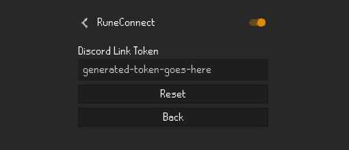

# RuneConnect

Sends clan chat, coffer transactions, and rank icons to your clan's companion Discord app, RuneBot .

* Talks only to RuneConnect's own server; no third-party relay
* No messages saved.

### Get In-Game Clan Chat in Your Discord

### Get coffer transaction logs with screenshots

### Clan Ranks in the Broadcast

Messages sent to Discord display your clan rank icon next to your name making it easy to distinguish members.

## Plugin Setup

1. Search for **RuneConnect** in the RuneLite Plugin Hub and install it.
2. In your clan's Discord server, run `/setup runelite-link` (requires Manage Server permission) to get a link token.
   
3. Open this plugin's settings and paste the token into **Discord Link Token**.
   
4. That's it. Clan chat and coffer transactions will post to your server's configured channels.

## What data this plugin sends

- **Clan Chat messages**: your character name and message text, for every message sent in clan chat.
- **Coffer transaction details**: transaction type, amount, and the character name who performed it.
- **A screenshot of your RuneLite Client**, taken at the moment of each coffer transaction.
- **Rank Icon Images**: A small icon per clan rank, sent once the first time it's encountered.

No data is sent unless a valid Discord Link Token is configured. All data goes only to RuneConnect's own server; this plugin does not communicate with any other third party.